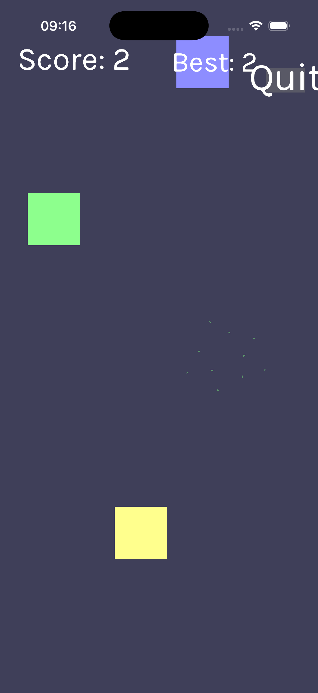
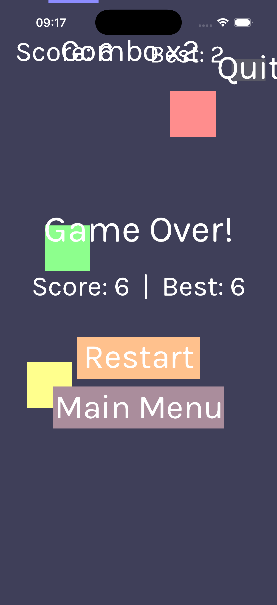

# Markmos

Cross-platform game engine with Metal backend (macOS/iOS) and Vulkan backend (Android).

## Features

- **C++23** without exceptions or RTTI
- **Renderer abstraction** — Metal (Apple) / Vulkan (Android)
- **Audio** via miniaudio
- **Memory management** via rpmalloc
- **Job system** for multithreaded tasks
- **Sprite batching** with efficient sorting

## Build

### iOS

```bash
cd engine
./build-ios.sh              # device debug
./build-ios-sim.sh          # simulator debug
DEVELOPMENT_TEAM=XXXXXXXX ./ios_build.sh   # release archive → .ipa
```

### Android

```bash
cd engine
./build-android.sh          # debug APK
CONFIG=Release ./build-android.sh  # release APK
```

## Project Structure

```
engine/
├── core/          # Memory, VFS, job system, utilities
├── render/        # Renderer, shaders, sprite batch
├── rhi/           # Metal/Vulkan backends
├── app/           # Platform entry points (iOS, Android, macOS)
├── thirdparty/    # rpmalloc, miniaudio, simdjson, stb, metal-cpp, VMA
├── shaders/       # GLSL sources (Vulkan)
└── entry/         # Game entry point
```

## Screenshots





## License

MIT
